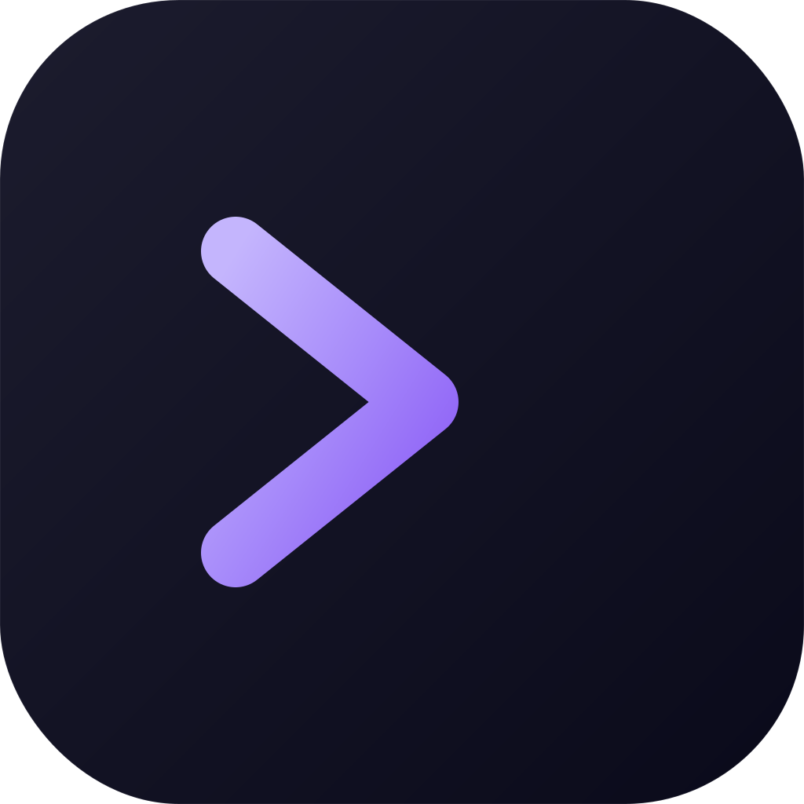
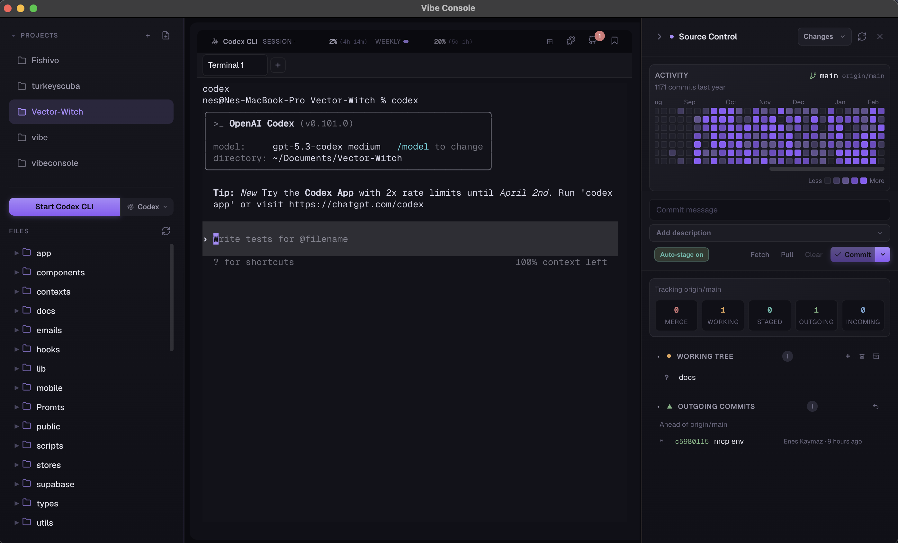

<p align="center">
  
</p>

<h1 align="center">VibeConsole</h1>

<p align="center">
  <strong>The terminal IDE built for AI coding workflows.</strong><br>
  Not a code editor — a <em>project management framework</em> for developers who ship with AI.
</p>

<!-- Badges -->
<p align="center">
  <a href="https://github.com/nesdesignco/vibeconsole/releases"></a>
  <a href="https://github.com/nesdesignco/vibeconsole/blob/main/LICENSE"></a>
  <a href="https://github.com/nesdesignco/vibeconsole/stargazers"></a>
  <a href="https://github.com/nesdesignco/vibeconsole/issues"></a>
  <a href="https://github.com/nesdesignco/vibeconsole/pulls"></a>
  
</p>

<p align="center">
  
  
  
  
</p>

<!-- Navigation -->
<p align="center">
  <a href="#-why-vibeconsole">Why?</a> •
  <a href="#-features">Features</a> •
  <a href="#-quick-start">Quick Start</a> •
  <a href="#%EF%B8%8F-keyboard-shortcuts">Shortcuts</a> •
  <a href="#-architecture">Architecture</a> •
  <a href="#%EF%B8%8F-roadmap">Roadmap</a> •
  <a href="#-faq">FAQ</a> •
  <a href="#-contributing">Contributing</a>
</p>

<br>

<p align="center">
  
</p>

---

## 💡 Why VibeConsole?

When developing with AI coding assistants, you don't need a traditional IDE — you need a **terminal**. But staying terminal-only means:

- Projects get **disorganized**
- Context gets **lost between sessions**
- Decisions are **forgotten**

**VibeConsole** solves this by combining a multi-terminal workspace with project management tools that preserve context across sessions.

> Works with **Claude Code**, **Codex CLI**, **Gemini CLI**, and any terminal-based AI tool.
> Your AI writes the code. VibeConsole keeps you organized.

---

## ✨ Features

<table>
<tr>
<td width="50%" valign="top">

### 🖥️ Multi-Terminal
Up to **9 independent terminals** with tabs or grid view.
Flexible layouts: `2×1` `2×2` `3×1` `3×2` `3×3`

### 📁 Project Explorer
File tree with **drag-drop** to terminal, context menu, rename, delete, and a quick **editor overlay** for fast edits.

### 🔀 Git Integration
Built-in panel for **staged/unstaged changes**, branches, worktrees, and full **inline diffs** with syntax highlighting.

### 💾 Saved Prompts
Save and reuse your most common prompts across sessions. One-click paste to terminal.

</td>
<td width="50%" valign="top">

### 🧩 Plugin System
Extend VibeConsole with **JavaScript plugins**. Official marketplace + local plugin support.

### 🧠 Context Preservation
`AGENTS.md`, `STRUCTURE.json`, and `PROJECT_NOTES.md` keep your architectural decisions and project context alive across sessions.

### 📊 Usage Tracking
Real-time **Claude & Codex usage** monitoring. Session utilization, weekly limits, and reset timers.

### 🤖 AI Tool Selector
Switch between **Claude Code**, **Codex CLI**, and **Gemini CLI** from the toolbar. Each terminal can run a different tool.

</td>
</tr>
</table>

**Also includes:** Prompt history with timestamps • Auto-updater • Keyboard-driven workflow • Drag file → terminal pastes quoted path • macOS native menus

---

## 🚀 Quick Start

### Install & Run

```bash
git clone https://github.com/nesdesignco/vibeconsole.git
cd vibeconsole
npm install
npm start
```

### Development

```bash
npm run dev          # Watch mode + launch app
npm run build        # Bundle renderer + create macOS DMG
npm run lint         # Run ESLint
npm test             # Run tests
```

### Build for Distribution

```bash
npm run dist:mac     # Create signed macOS DMG
```

> **Requirements:** Node.js 18+ • macOS • Git

---

## ⌨️ Keyboard Shortcuts

| Shortcut | Action |
|----------|--------|
| <kbd>Ctrl</kbd>+<kbd>K</kbd> | Launch Claude Code in active terminal |
| <kbd>Ctrl</kbd>+<kbd>Shift</kbd>+<kbd>T</kbd> | New terminal |
| <kbd>Ctrl</kbd>+<kbd>Shift</kbd>+<kbd>W</kbd> | Close terminal |
| <kbd>Ctrl</kbd>+<kbd>Tab</kbd> / <kbd>Ctrl</kbd>+<kbd>Shift</kbd>+<kbd>Tab</kbd> | Next / Previous terminal |
| <kbd>Ctrl</kbd>+<kbd>1</kbd> – <kbd>9</kbd> | Jump to terminal N |
| <kbd>Ctrl</kbd>+<kbd>Shift</kbd>+<kbd>G</kbd> | Toggle grid view |
| <kbd>Ctrl</kbd>+<kbd>B</kbd> | Toggle sidebar |
| <kbd>Ctrl</kbd>+<kbd>Shift</kbd>+<kbd>H</kbd> | Toggle history panel |
| <kbd>Ctrl</kbd>+<kbd>Shift</kbd>+<kbd>P</kbd> | Toggle saved prompts |
| <kbd>Ctrl</kbd>+<kbd>Shift</kbd>+<kbd>B</kbd> | Toggle git branches |

---

## 🏗️ Architecture

```
src/
├── main/           # Main process — PTY, file tree, git, plugins
├── renderer/       # Renderer process — terminal UI, panels, styles
└── shared/         # IPC channel constants, path validation
```

> See [`STRUCTURE.json`](STRUCTURE.json) for the full module map.

---

## 🗺️ Roadmap

- [x] Multi-terminal with grid layouts
- [x] File tree with drag-drop to terminal
- [x] Git changes, branches, and worktrees
- [x] Plugin system with marketplace
- [x] Claude & Codex usage tracking
- [x] Saved prompts panel
- [x] Auto-updater
- [ ] Windows & Linux support
- [ ] Theme customization
- [ ] Remote SSH terminal support

> Have an idea? [Open an issue](https://github.com/nesdesignco/vibeconsole/issues) with the `enhancement` label.

---

## 🛠️ Tech Stack

<table>
<tr>
<td align="center" width="150">
  <br>
  <sub><b>Electron 28</b></sub><br>
  <sub>Desktop framework</sub>
</td>
<td align="center" width="150">
  <br>
  <sub><b>JavaScript</b></sub><br>
  <sub>Language</sub>
</td>
<td align="center" width="150">
  <br>
  <sub><b>Node.js 18+</b></sub><br>
  <sub>Runtime</sub>
</td>
<td align="center" width="150">
  <br>
  <sub><b>esbuild</b></sub><br>
  <sub>Bundler</sub>
</td>
</tr>
<tr>
<td align="center" width="150">
  <br>
  <sub><b>xterm.js 5.3</b></sub><br>
  <sub>Terminal emulator</sub>
</td>
<td align="center" width="150">
  <br>
  <sub><b>node-pty 1.0</b></sub><br>
  <sub>PTY management</sub>
</td>
<td align="center" width="150">
  <br>
  <sub><b>Git</b></sub><br>
  <sub>Version control</sub>
</td>
<td align="center" width="150">
  <br>
  <sub><b>ESLint</b></sub><br>
  <sub>Code quality</sub>
</td>
</tr>
</table>

---

## ❓ FAQ

<details>
<summary><strong>Why not just use VS Code with a terminal?</strong></summary>
<br>
VS Code is a code editor that happens to have a terminal. VibeConsole is a terminal that happens to have project management tools. When you're using AI to write code, you spend 90% of your time in the terminal — VibeConsole is designed for that workflow.
</details>

<details>
<summary><strong>Does it work on Windows/Linux?</strong></summary>
<br>
Currently macOS only. Windows and Linux support is on the roadmap. The codebase is cross-platform ready (node-pty and xterm.js support all platforms), but we haven't tested and polished the experience yet.
</details>

<details>
<summary><strong>What shells are supported?</strong></summary>
<br>
Any shell on your system — zsh, bash, fish, etc. VibeConsole uses your default <code>$SHELL</code>.
</details>

---

## 🤝 Contributing

We love contributions! Whether it's a bug fix, new feature, or documentation improvement.

1. Fork the repository
2. Create your branch (`git checkout -b feat/amazing-feature`)
3. Make your changes and run `npm run lint`
4. Commit (`git commit -m 'Add amazing feature'`)
5. Push (`git push origin feat/amazing-feature`)
6. Open a Pull Request

See [**CONTRIBUTING.md**](CONTRIBUTING.md) for detailed guidelines.

| Type | Link |
|------|------|
| 🐛 Bug Report | [Open an issue](https://github.com/nesdesignco/vibeconsole/issues/new?template=bug_report.md) |
| 💡 Feature Request | [Open an issue](https://github.com/nesdesignco/vibeconsole/issues/new?template=feature_request.md) |
| 🔒 Security | [SECURITY.md](SECURITY.md) |
| 📖 Docs | [CONTRIBUTING.md](CONTRIBUTING.md) |

---

## 👥 Contributors

<a href="https://github.com/nesdesignco/vibeconsole/graphs/contributors">
  
</a>

## 📄 License

[MIT](LICENSE) © 2026 [nesdesignco](https://github.com/nesdesignco)
